### Installation of Odoo 16 using WSL, and configure it with VSCode
#### Install WSL
To install WSL (Windows Subsystem for Linux) on Windows 11 from Command Prompt, use these steps:

1. Open Start on Windows 11.
2. Search for Command Prompt (or PowerShell), right-click the top result, and select the Run as administrator option.
3. Type the following command to install the WSL on Windows 11 and press Enter:
     `wsl --install`


4. Restart your computer to finish the WSL installation on Windows 11.
5. Continue with the Linux distro setup as necessary.

Once you complete the steps, the required Linux.
components will install automatically on Windows 11 and the latest version of the Ubuntu Linux distribution.

----------

#### Update WSL kernel
To update the WSL kernel from Command Prompt on Windows 11, use these steps:

1. Open Start.

2. Search for Command Prompt, right-click the top result, and select the Run as administrator option.

3. Type the following command to update the WSL kernel on Windows 11 and press Enter:
`wsl --update`


After you complete the steps, if an update is available, it will download and install on your computer.

----------

#### Install ubuntu 20.04.6 LTS from Microsoft store
Download it, then run it
[Link to install ubuntu 20.04.6 LTS on Microsoft store](https://www.microsoft.com/store/productId/9MTTCL66CPXJ?ocid=pdpshare)

----------

#### Pre-Install Odoo 16
1. Update Package Manager
Before installing Odoo, make sure your Ubuntu package manager is up to date by executing the following commands:
```
sudo apt-get update
sudo apt-get upgrade -y
```
2. Create an Odoo User
To ensure proper system management, create an Odoo user with administrative privileges using the following command:

`sudo adduser --system --home=/opt/odoo --group odoo
`
- Change Odoo user password: `sudo passwd odoo`
- Adding the User to the sudo Group 
`usermod -aG sudo odoo`
- Add odoo user to bash
`sudo usermod -s /bin/bash odoo`
3. Install PostgreSQL and Create an Odoo User for PostgreSQL
Odoo relies on PostgreSQL as its database server. Install PostgreSQL and create an Odoo user for database access:

```
sudo apt install postgresql -y
sudo su - postgres -c "createuser -s odoo" 2> /dev/null || true
sudo chmod 700 -R /var/lib/postgresql/12/main/
sudo systemctl restart postgresql
```
4. Installation of Python and Python PIP Dependencies
Install Python and Python PIP dependencies required for Odoo:

```
sudo apt-get install git python3 python3-pip build-essential wget python3-dev python3-venv python3-wheel libxslt-dev libzip-dev libldap2-dev libsasl2-dev python3-setuptools node-less libjpeg-dev gdebi -y
sudo apt-get install libpq-dev python3-dev libxml2-dev libxslt1-dev libldap2-dev libsasl2-dev libffi-dev python3-psutil python3-polib python3-dateutil python3-decorator python3-lxml python3-reportlab python3-pil python3-passlib python3-werkzeug python3-psycopg2 python3-pypdf2 python3-gevent -y
```
5. Additional Packages Required
Node.js is required for Odoo 16. Install it with the following command:
`sudo apt-get install nodejs npm -y`
If you need right-to-left CSS or language support in Odoo, you can add it with:
`sudo npm install -g rtlcss`

6. Installation of wkhtmltox
To enable Odoo 16 to generate PDF reports, install wkhtmltopdf:

```
sudo apt-get install xfonts-75dpi xfonts-base -y
sudo apt-get -y install wkhtmltopdf
```

7. Create a Log Directory and Provide Permissions
Create a log directory for Odoo and grant the necessary write permissions:
```
sudo mkdir /var/log/odoo
sudo chown odoo:odoo /var/log/odoo
```
----------

#### Install&Run Odoo 16
1. Install Git
`sudo apt-get install git`
2. Install Odoo 
```
sudo git clone https://www.github.com/odoo/odoo /opt/odoo/odoo-server -b 16.0 --depth 1
```
3. Setup Required Permissions
After installing Odoo 16, set the required permissions for it to function properly:
`sudo chown -R odoo:odoo /opt/odoo/`
4. Creation of a Server Configuration File
Create a configuration file for Odoo:
```
sudo touch /opt/odoo/odoo-server/odoo-server.conf
sudo su root -c "printf '[options]\n' | sudo tee /opt/odoo/odoo-server/odoo-server.conf"
sudo su root -c "printf 'admin_passwd = admin\n' | sudo tee -a /opt/odoo/odoo-server/odoo-server.conf"
sudo su root -c "printf 'xmlrpc_port = 9080\n' | sudo tee -a /opt/odoo/odoo-server/odoo-server.conf"
sudo su root -c "printf 'logfile = /var/log/odoo/odoo-server.log\n' | sudo tee -a /opt/odoo/odoo-server/odoo-server.conf"
sudo su root -c "printf 'addons_path=/opt/odoo/odoo-server/addons\n' | sudo tee -a /opt/odoo/odoo-server/odoo-server.conf"
```
Give the configuration file appropriate permissions:
```
sudo chown odoo:odoo /opt/odoo/odoo-server/odoo-server.conf
sudo chmod 640 /opt/odoo/odoo-server/odoo-server.conf
sudo chmod o+w /opt/odoo/odoo-server/odoo-server.conf
```
5. Create a Python Virtual Environment
To isolate the Odoo installation, create a Python virtual environment:
```
sudo su -l odoo -s /bin/bash
cd odoo-server
python3 -m venv odoo-venv
source odoo-venv/bin/activate
pip3 install wheel
pip3 install -r requirements.txt
deactivate
```

7. Start the Odoo Instance
Now, start the Odoo service by executing the following commands:

```
cd /opt/odoo/odoo-server
sudo su odoo -s /bin/bash
source odoo-venv/bin/activate
./odoo-bin -c odoo-server.conf
```
8. Final Step with Odoo-WSL config is to set odoo user as default user:
- Navigate to `/etc/wsl.conf` and add:
```
[user]
default=odoo
```
- Restart WSL, write is your PowerShell windo `wsl --shutown`, then start it again by running `wsl` command.

----------

#### Configure Odoo WSL with VSCode
1. Install WSL extension
- From extensions 

- Search for `wsl` in search bar

- Install `wsl`, then reload VSCode.
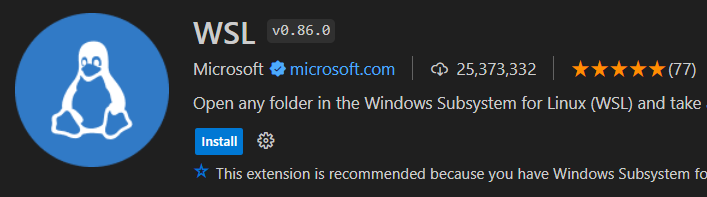

2. Start WSL
- In the bottom left click on WSL Icon
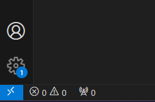
3. Connect to WSL
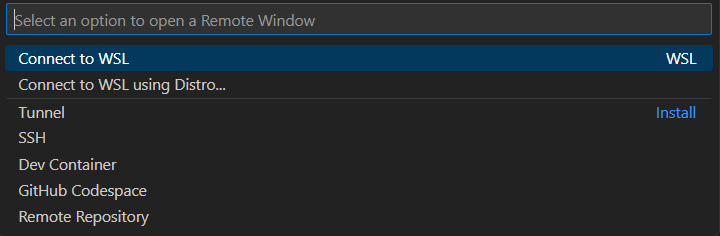
3. After connecting, click on vscode explorer and click on **Open Folder** 
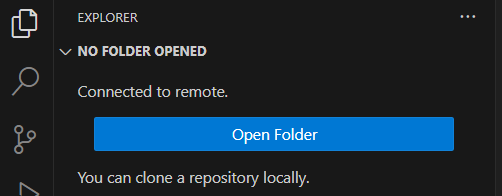
4. From the dropdown popup navigate to the **odoo-server** folder, and Press **OK**.
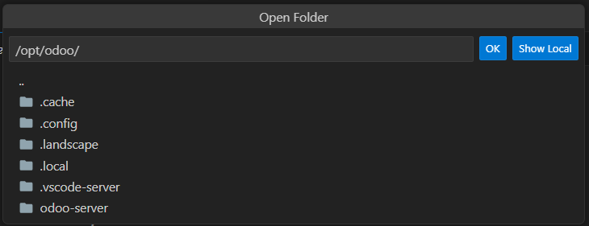
5. Install python extension in WSL environment
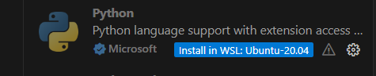

----------

#### Final Step: Configure VSCode Run and Debug
1. click on Run and Debug icon as shown
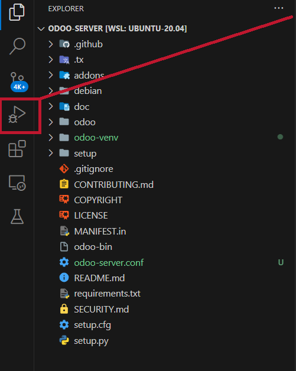
2. Click on create launch.json file then select **Python Debugger**, then **Python File**
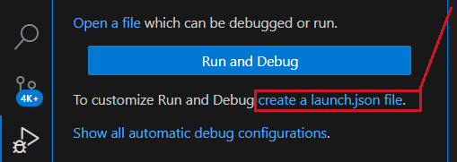
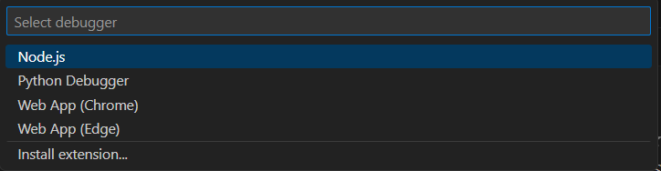
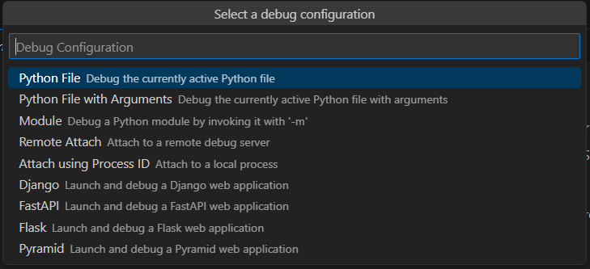
3. Paste this in your launch.json file:
```
{
    "version": "0.2.0",
    "configurations": [
        {
        "name": "dev_16",
        "type": "debugpy",
        "request": "launch",
        "program": "/opt/odoo/odoo-server/odoo-bin",
        "console": "integratedTerminal",
        "env": {
            "GEVENT_SUPPORT": "True"},
            "args" : [
                "-r",
                "odoo",
                "--save",
                "--config=/opt/odoo/odoo-server/odoo-server.conf",
                "--addons-path=/opt/odoo/odoo-server/addons",
                "--dev",
                "xml",
            ]
        }
    ]
}
```
4. Run
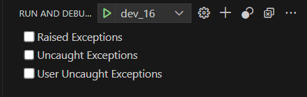
5. And **Open in browser** 
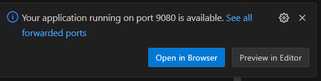